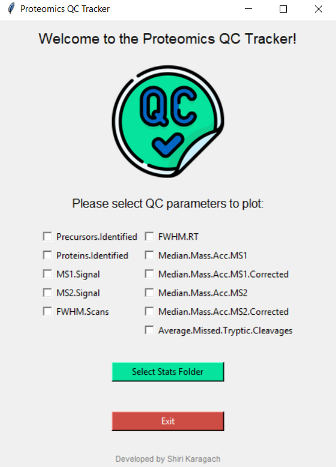
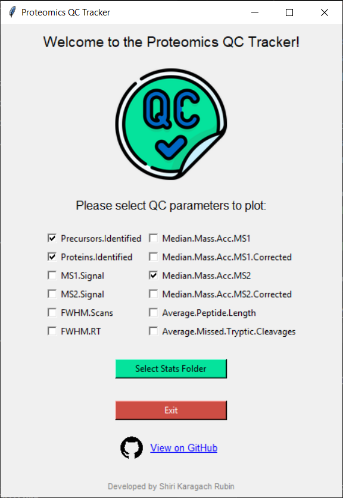
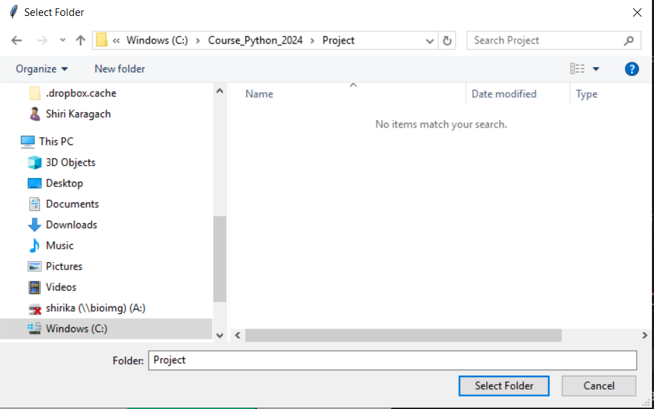
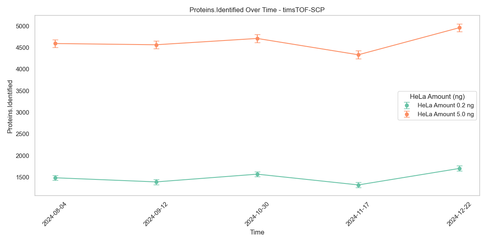
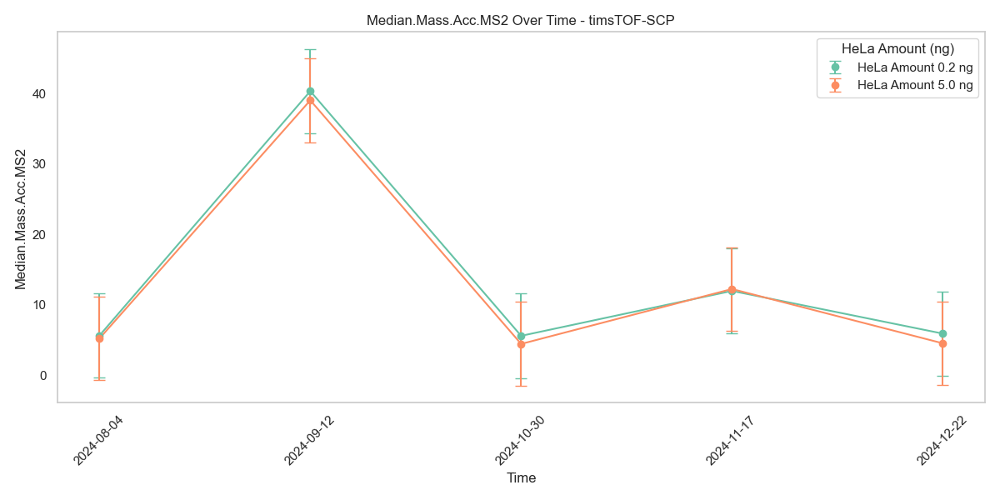

# **Proteomics QC Tracker**  
*A tool for tracking your mass spectrometer's (MS) performance over time.*  


---

## **What is Proteomics?**  
Proteomics is the large-scale study of proteins, the essential molecules of life that perform most biological functions. By analyzing the proteome—an organism's complete set of proteins—researchers gain critical insights into cellular processes, disease mechanisms, and potential therapeutic targets.  

The cornerstone of proteomics is **mass spectrometry (MS)**, a technique that identifies and quantifies proteins in samples ranging from large tissues to individual cells. A **mass spectrometer** achieves this precision, making it indispensable in cutting-edge research.  

---

## **Overview**  
The **Proteomics Quality Control (QC) Tracker** helps researchers monitor the performance of mass spectrometers over time, ensuring reliable and reproducible results in proteomics experiments.  
Briefly, I work in a proteomics lab where we use data from mass spectrometers to investigate protein dynamics across various cancer types. The mass spectrometer (MS) is the key instrument we use to identify and quantify proteins in our samples. A critical technical requirement is monitoring the performance of the MS over time to ensure consistent functionality. This prevents batch effects caused by performance drift and ensures the reliability of our biological insights.
To achieve this, we regularly inject a quality control (QC) sample containing a known amount (0.2 or 5 ng) of HeLa protein digest. We evaluate MS performance using several metrics, such as the number of proteins identified and mass accuracy. I aim to create a GUI using Tkinter that enables lab members to upload QC data files weekly. The app will visualize the MS QC status over time using a time-series plot, providing an intuitive way to track performance trends.

### **Key Features:**  
- Tracks essential QC metrics like accuracy and resolution.  
- Supports early detection of instrument performance issues.  
- Enhances reproducibility across longitudinal and multi-laboratory studies.  
- Provides data quality assurance for downstream analyses.  

---

## **Why QC is Crucial in Proteomics**  

Mass spectrometry is sensitive and susceptible to performance drift. Integrating regular QC monitoring ensures consistent, high-quality results.  

### **Benefits of QC Monitoring:**  

1. **Instrument Stability and Reliability**  
   Regular QC checks prevent performance degradation due to wear, contamination, or calibration issues, ensuring consistent operation.  

2. **Reproducibility of Results**  
   Proteomics experiments span extended timeframes. QC ensures datasets remain comparable and reliable.  

3. **Early Detection of Issues**  
   Detect issues like signal loss or poor calibration early to minimize downtime and prevent data loss.  

4. **Data Quality Assurance**  
   High-quality data is critical for protein quantification and biomarker discovery. QC maintains confidence in peak intensities, retention times, and mass accuracy.  

5. **Standardization Across Studies**  
   QC data help standardize performance in multi-laboratory or longitudinal studies, reducing variability.  

6. **Regulatory and Publication Requirements**  
   Documented QC provides an audit trail for GLP (Good Laboratory Practice) compliance and strengthens publication credibility.  

7. **Optimization of Experimental Design**  
   Use QC data to refine experimental workflows, optimizing instrument settings for specific applications.  

8. **Cost Efficiency**  
   QC monitoring reduces reagent and sample waste, preventing costly re-runs.  

---

## **How It Works**  
- **Compatibility**: the tool is suitable for researchers using [DIA-NN](https://github.com/vdemichev/DiaNN) software.
- **Requirements**: The software asks the user to upload a "stats" .tsv file, which is one of the output tables generated in DIA-NN report.
  The "stats.tsv" file contains the following columns:
   

The Proteomics QC Tracker evaluates key metrics, including:  
- **Resolution**:  Confirms high-resolution identification by monitoring the number of proteins identified in HeLa protein digestion of 0.2ng and 5ng.  
- **Mass Accuracy**: Confirms and precise quantification by showing MS1 and MS2 median mass accuracy. 
By integrating QC monitoring into your workflow, you can trust your data and maximize your mass spectrometer's performance.  

---

## **How to run this tool?** 
1. Ensure Python is installed (version 3.7 or later is recommended). If needed, install it here: [Download Python Official Website](https://www.python.org/downloads/)
2. Download the script file called Proteomics_QC_Tracker.py from this repository
4. Download all "stats.tsv" files into the same folder as the script file (if you have your own "stats.tsv" files, add them into the same folder).
5. If you added your files, add the QC date into the file name in the format DATE/MONTH/YEAR (e.g., 3-February 2025 would be: 03022025).
6. Access the file folder by typing this in the terminal
   ``` bash
   cd path/to/project/folder
   ``` 
7. Create a virtual environment 

For Windows:
```bash
python -m venv env
env\Scripts\activate
```
For macOS/Linux:
```bash
python3 -m venv env
source env/bin/activate

8. Install dependencies using the requirements.txt file found in this repository:
```bash
pip install -r requirements.txt
```
Optional: verify that all dependencies are installed successfully by running:

```bash
pip list
```
8. Run the tool by typing in the terminal:
```bash
.\Proteomics_QC_Tracker.py
```
---

## **Navigating in the GUI**
This window should appear when the GUI is initialized:



User chooses which metrics to plot:



Select the folder that contains the stat files and where the database will be saved 
(the result of clicking on the green button):



The database is saved:


Visualization of plots that the user selected:





---
🎓 This project was written as part of the [Python course](https://github.com/szabgab/wis-python-course-2024-11) at the Weizmann Institute of Science.
