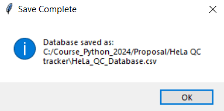

# **Proteomics QC Tracker**  
*A tool for tracking your mass spectrometer's (MS) performance over time.*  


---

## **What is Proteomics?**  
Proteomics is the large-scale study of proteins, the essential molecules of life that perform most biological functions. Researchers gain critical insights into cellular processes, disease mechanisms, and potential therapeutic targets by analyzing the proteome- an organism's complete set of proteins.  

The cornerstone of proteomics is **mass spectrometry (MS)**, a technique that identifies and quantifies proteins in samples ranging from large tissues to individual cells. A **mass spectrometer** achieves this precision, making it indispensable in cutting-edge research.  

---

## **Overview**  
The **Proteomics Quality Control (QC) Tracker** helps researchers monitor the performance of mass spectrometers over time, ensuring reliable and reproducible results in proteomics experiments.  
Briefly, I work in a proteomics lab where we use data from mass spectrometers to investigate protein dynamics across various cancer types. The mass spectrometer (MS) is the key instrument we use to identify and quantify proteins in our samples. A critical technical requirement is monitoring the performance of the MS over time to ensure consistent functionality. This prevents batch effects caused by performance drift and ensures the reliability of our biological insights.
We regularly inject a quality control (QC) sample containing a known amount (0.2 or 5 ng) of HeLa protein digest to achieve this. We evaluate MS performance using several metrics, such as the number of proteins or peptides identified, mass accuracy, and more. Using the Python Tkinter package, I created a GUI that enables lab members to upload QC data files weekly. The tool will visualize the MS QC status over time using time-series plots that can be chosen by the user, providing an intuitive way to track performance trends.

### **Key Features:** 📊 
- Tracks essential QC metrics like accuracy and resolution.  
- Supports early detection of instrument performance issues.  
- Enhances reproducibility across longitudinal and multi-laboratory studies.  
- Provides data quality assurance for downstream analyses.  

---

## **Why QC is Crucial in Proteomics** 🔎 

Mass spectrometry is sensitive and susceptible to performance drift. Integrating regular QC monitoring ensures consistent, high-quality results.  

### **Benefits of QC Monitoring:** 💡

1. **Instrument Stability and Reliability**  
   Regular QC checks prevent performance degradation due to wear, contamination, or calibration issues, ensuring consistent operation.  

2. **Reproducibility of Results**  
   Proteomics experiments span extended timeframes. QC ensures datasets remain comparable and reliable.  

3. **Early Detection of Issues**  
   Detect issues like signal loss or poor calibration early to minimize downtime and prevent data loss.  

4. **Data Quality Assurance**  
   High-quality data is critical for protein quantification and biomarker discovery. QC maintains confidence in peak intensities, retention times, and mass accuracy.  

5. **Standardization Across Studies**  
   QC data help standardize performance in multi-laboratory or longitudinal studies, reducing variability.  

6. **Regulatory and Publication Requirements**  
   Documented QC provides an audit trail for GLP (Good Laboratory Practice) compliance and strengthens publication credibility.  

7. **Optimization of Experimental Design**  
   Use QC data to refine experimental workflows, optimizing instrument settings for specific applications.  

8. **Cost Efficiency**  
   QC monitoring reduces reagent and sample waste, preventing costly re-runs.  

---

## **How It Works**  
- **Compatibility**: the tool is suitable for researchers using [DIA-NN](https://github.com/vdemichev/DiaNN) software 

- **Requirements**: The software asks the user to upload a "stats" .tsv file, one of the output tables generated in the DIA-NN report.
  The "stats.tsv" file contains the following columns:
   

**Input "stats.tsv" File Example**:
 | File.Name                                                                 | Precursors.Identified | Proteins.Identified | Total.Quantity | MS1.Signal | MS2.Signal | FWHM.Scans | FWHM.RT | Median.Mass.Acc.MS1 | Median.Mass.Acc.MS1.Corrected | Median.Mass.Acc.MS2 | Median.Mass.Acc.MS2.Corrected | MS2.Mass.Instability | Normalisation.Instability | Median.RT.Prediction.Acc | Average.Peptide.Length | Average.Peptide.Charge | Average.Missed.Tryptic.Cleavages |
|--------------------------------------------------------------------------|------------|-------------|------------|-----------|-----------|---------|---------|-----------|-----------|-----------|-----------|----------|-----------|-----------|-----------|-----------|-----------|
| Hela_QC_02ng_13727.d.dia | 6475       | 1541        | 6.76E+06   | 1.02E+10  | 3.58E+10  | 2.019   | 0.032   | 4.60602  | 2.18957  | 5.54106  | 4.58321  | 0        | 0.134232  | 0.00889973 | 10.449    | 2.089     | 0.192     |
| Hela_QC_5ng_13728.d.dia | 6854       | 1498        | 8.42E+06   | 1.4E+10   | 5.32E+10  | 2.052   | 0.032   | 4.65333  | 2.13325  | 5.46158  | 4.49295  | 0        | 0.0854085 | 0.00817859 | 10.453    | 2.1       | 0.214     |
| Hela_QC_5ng_13730.d.dia | 6035       | 1474        | 6.74E+06   | 1.05E+10  | 4.36E+10  | 2.08    | 0.033   | 4.16335  | 2.17015  | 5.87256  | 4.83991  | 0        | 0.102536  | 0.00995632 | 10.504    | 2.092     | 0.188   

${\color{#D22B2B}Of\ note,\ for\ time\ series\ plots,\ more\ than\ one\ stats\ file\ is\ required}$

The Proteomics QC Tracker evaluates key metrics, including:  
- **Resolution**:  Confirms high-resolution identification by monitoring the number of proteins identified in HeLa protein digestion of 0.2ng and 5ng.  
- **Mass Accuracy**: Confirms and precise quantification by showing MS1 and MS2 median mass accuracy. 
By integrating QC monitoring into your workflow, you can trust your data and maximize your mass spectrometer's performance.  

---

## **How to run this tool?** 🏃‍♀️
### 1. Python installation 
Ensure Python is installed (version 3.7 or later is recommended). If needed, install it here: [Download Python Official Website](https://www.python.org/downloads/)
### 2. Download the repository
Direct Download as a ZIP File (No Git Required)
Go to the Repository's GitHub Page
Open the GitHub repository in your browser.
Click the green Code button.
Select Download ZIP.
Extract the downloaded ZIP file to access all the repository files.
-Note: Ensure that the script file called Proteomics_QC_Tracker.py from this repositoryand  all "stats.tsv" files into the same folder as the script file. 
### 3. Optional: Add your own QC files and modify file names
If you added your  "stats.tsv" files, make sure you saved them into the same folder as the script file. Also, to enable time series plots, make sure the file name is in the format DATE/MONTH/YEAR (e.g., 3-February 2025 would be: 03022025).
### 4. Access the file folder 
Type in the terminal the path to the folder using the cd:
   ``` bash
   cd path/to/project/folder
   ```
### 5. Dependencies 

Install dependencies using the requirements.txt file found in this repository:

```bash
pip install -r requirements.txt
```
Optional: verify that all dependencies are installed successfully by running:

```bash
pip list
```
Required packages include:
- pandas
- tkinter
- matplotlib
- numpy
- seaborn
- datetime
- pillow
- re
- os
- webbrowser
- pytest

### 6. Run the tool ▶️
Run the tool by typing in the terminal:
     
```bash
python .\Proteomics_QC_Tracker.py
```
---

## **Navigating in the GUI** 🧭
This window should appear when the GUI is initialized:


The user chooses which metrics to plot and selects the stats file containing folder:


Select the <ins> folder that contains the stat files </ins>  and where the database will be saved 
(the result of clicking on the green button):


The database is saved in a csv file called "HeLa_QC_Database.csv":



## **Output** 📝

### QC Database 
The HeLa_QC_Database.csv" file is being created. In addition to the stat columns, three extra columns are being added, extracting information from the file names:
1. "HeLa_amounts", specifying the low and high HeLa amounts injected)
2. "Creation_Date", adding the temporal information needed to plot a time series plot.
3. "User initials", to know who was the user that ran the QC in the instruments. At the moment, it has four users from my lab SK, JS, SP and GE (please modify file names with your lab users' initials, else it will insert "unknown").

The database can be updated by running the tool each time a new "stats.tsv" file is added to the folder.

### Visualization of plots that the user selected: 📈


---
## **Running a test file** 💉
To run the test file in the terminal, use:

```bash
python .\Test.py
```
## **Upcoming Features (under development)** 💻🔨
Based on feedback from potential users, my lab members, I came up with several enhancements aiming to improve the tool's functionality and usability in the future:
- **Integration with Maintenance Logbook Table**  
To better understand the contributors to MS performance trends (improvement/deterioration), the tool will integrate technical data from the instrument maintenance logbook. I would like to merge technical information from the instrument side (e.g, changing the analytical column, preventive maintenance, cleaning or replacing a part, into the database. This information could be plotted in the output graphs and help explain the signal trends since the date alone is not indicative enough.
- **Sample Counter**
  Track the number of samples run between QC runs. Helps prevent overloading the system with excessive or "dirty" samples and provides actionable insights for maintaining consistent MS performance.
-  **Automation**
Automating the tool will reduce manual intervention and keep the database updated effortlessly. The idea is to automatically detect new `stats.tsv` files in a designated folder the will trigger data import and processing scripts upon file addition. Using Task Scheduler (Windows), or cloud-based automation.

❓ Let me know if you have any questions or feedback by opening an issue or contacting the project maintainer!

---
🎓 This project was written as part of the [Python course](https://github.com/szabgab/wis-python-course-2024-11) at the Weizmann Institute of Science taught by [Gábor Szabó](https://github.com/szabgab).
